# wireguard-socks
Dedicated container to HTTP Proxy through a Wireguard VPN.

## Network Flow

The container combines a WireGuard client and a SOCKS proxy server to route traffic through a VPN:

```mermaid
graph LR
    subgraph "Docker Container"
        SOCKS["SOCKS Proxy"]
        WG["WireGuard\nClient<br>:51820/udp"]
        SOCKS -- Route --> WG
    end
    
    Client -- "SOCKS:1080/tcp" --> SOCKS
    WG -- Tunnel --> WGServer["WireGuard Server"] 
    WGServer -- Forward --> Internet((Internet))

    style Docker Container fill:#2f2f2f,stroke:#666,stroke-width:2px
    style Client fill:#1f1f1f,stroke:#333
    style SOCKS fill:#2f2f2f,stroke:#333
    style WG fill:#2f2f2f,stroke:#333
    style WGServer fill:#1f1f1f,stroke:#333
    style Internet fill:#1f1f1f,stroke:#333
```



Simple flow:
```
Client → SOCKS Proxy (1080) → WireGuard Client → WireGuard Server → Internet
(socks client)     (socks-server)        (wg-client)        (wg-server)
                   [Container Port 1080]  [Container]        [Remote VPN]
```

Network Details:
- SOCKS Proxy Server: Listens on port 1080 for incoming SOCKS5 connections
- WireGuard Client: Routes all traffic through the WireGuard tunnel (UDP port 51820)
- Both SOCKS server and WireGuard client run in the same container
- Traffic flow: Client → SOCKS (1080/tcp) → WireGuard (51820/udp) → Internet

## Prerequisites:
 - Docker
 - Wireguard configuration file

1. Create/download a wireguard config (e.g. wg0.conf) with desired wireguard VPN configuration, put it into current folder.

Example:
```
[Interface]
Address = ${CLIENT_IP}
PrivateKey = $(cat /config/${PEER_ID}/privatekey-${PEER_ID})
ListenPort = 51820
DNS = ${PEERDNS}

[Peer]
PublicKey = $(cat /config/server/publickey-server)
PresharedKey = $(cat /config/${PEER_ID}/presharedkey-${PEER_ID})
Endpoint = ${SERVERURL}:${SERVERPORT}
PersistentKeepalive = 25
AllowedIPs = 0.0.0.0/0
```

2. Run the docker container with the following command:

```
docker run -d \
  --name=wireguard-socks \
  --cap-add=NET_ADMIN \
  --restart=always \
  -e PUID=1000 \
  -e PGID=1000 \
  -e TZ=$(timedatectl show --property=Timezone --value 2>/dev/null || cat /etc/timezone) \
  -e LOG_CONFS=true \
  -p ${SOCKS_PORT:-1080}:${SOCKS_PORT:-1080} \
  -p ${WIREGUARD_PORT:-51820}:${WIREGUARD_PORT:-51820}/udp \
  --dns=${DNS:-1.1.1.1} \
  -v "${CONFIG_PATH:-.}:/config/wg_confs" \
  --sysctl="net.ipv4.conf.all.src_valid_mark=1" \
  chillosu/wireguard-socks
```

3. Reveal egress through your new socks proxy:

`curl -x socks5://localhost:1080 ipinfo.io`

4. Reveal egress without your new socks proxy:

`curl ipinfo.io`
