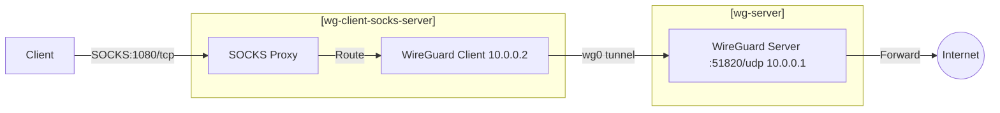

# wireguard-socks
[](https://github.com/chillosu/wireguard-socks/actions/workflows/docker-build.yml)

Dedicated container to HTTP Proxy through a Wireguard VPN using https://github.com/linuxserver/docker-wireguard as a base.

## Network Flow

The container (wg-client-socks-server below) combines a WireGuard client and a SOCKS proxy server to route traffic through a VPN:



Network Details:
- SOCKS Proxy Server: Listens on port 1080 for incoming SOCKS5 connections
- WireGuard Client: Routes all traffic through the WireGuard tunnel (UDP port 51820)
- Both SOCKS server and WireGuard client run in the same container
- Traffic flow: Client → SOCKS (1080/tcp) → WireGuard (51820/udp) → Internet

## Run me:

1. Download Docker
2. Create/download wireguard client config (e.g. wg0.conf) with desired wireguard VPN configuration, put it into current folder.

Example:
```
[Interface]
Address = ${CLIENT_IP}
PrivateKey = $(cat /config/${PEER_ID}/privatekey-${PEER_ID})
ListenPort = 51820
DNS = ${PEERDNS}

[Peer]
PublicKey = $(cat /config/server/publickey-server)
PresharedKey = $(cat /config/${PEER_ID}/presharedkey-${PEER_ID})
Endpoint = ${SERVERURL}:${SERVERPORT}
PersistentKeepalive = 25
AllowedIPs = 0.0.0.0/0
```

3. Run the container to serve the SOCKS proxy locally on port 1080:

```
docker stop wireguard-socks
docker rm wireguard-socks
docker pull chillosu/wireguard-socks
docker run -d \
  --name=wireguard-socks \
  --cap-add=NET_ADMIN \
  --restart=always \
  -e TZ=$(timedatectl show --property=Timezone --value 2>/dev/null || cat /etc/timezone) \
  -p ${SOCKS_PORT:-1080}:${SOCKS_PORT:-1080} \
  -v "${CONFIG_PATH:-.}:/config/wg_confs" \
  --sysctl="net.ipv4.conf.all.src_valid_mark=1" \
  chillosu/wireguard-socks
```

For logs use `docker logs -f wireguard-socks`. To see health use `docker inspect wireguard-socks`.

4. Reveal returned public egress through your new socks proxy:

`curl -x socks5://${HOST:-localhost}:1080 ipinfo.io`

5. Reveal egress without your new socks proxy:

`curl ipinfo.io`

6. Recommend using https://github.com/willfarrell/docker-autoheal and https://github.com/containrrr/watchtower with this.
